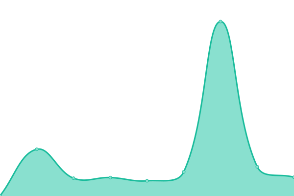

# [📈 Live Status](https://cssllc.github.io/Sites-Dashboard-Test): <!--live status--> **🟩 All systems operational**

This repository contains the open-source uptime monitor and status page for [Caleb Stauffer Style](https://develop.calebstauffer.com), powered by [Upptime](https://github.com/upptime/upptime).

With [Upptime](https://upptime.js.org), you can get your own unlimited and free uptime monitor and status page, powered entirely by a GitHub repository. We use [Issues](https://github.com/cssllc/Sites-Dashboard-Test/issues) as incident reports, [Actions](https://github.com/cssllc/Sites-Dashboard-Test/actions) as uptime monitors, and [Pages](https://cssllc.github.io/Sites-Dashboard-Test) for the status page.

<!--start: status pages-->
<!-- This summary is generated by Upptime (https://github.com/upptime/upptime) -->
<!-- Do not edit this manually, your changes will be overwritten -->
<!-- prettier-ignore -->
| URL | Status | History | Response Time | Uptime |
| --- | ------ | ------- | ------------- | ------ |
|  [Caleb Stauffer Style](https://develop.calebstauffer.com) | 🟩 Up | [caleb-stauffer-style.yml](https://github.com/cssllc/Sites-Dashboard-Test/commits/HEAD/history/caleb-stauffer-style.yml) | 

 264ms
     
 | 

<a href="https://monitor.calebstauffer.com/history/caleb-stauffer-style">100.00%</a>
    

|  [Rugby Americas North](https://rugbyamericasnorth.com) | 🟩 Up | [rugby-americas-north.yml](https://github.com/cssllc/Sites-Dashboard-Test/commits/HEAD/history/rugby-americas-north.yml) | 

 325ms
     
 | 

<a href="https://monitor.calebstauffer.com/history/rugby-americas-north">100.00%</a>
    

|  [The Realty Medics](https://www.therealtymedics.com) | 🟩 Up | [the-realty-medics.yml](https://github.com/cssllc/Sites-Dashboard-Test/commits/HEAD/history/the-realty-medics.yml) | 

 170ms
     
 | 

<a href="https://monitor.calebstauffer.com/history/the-realty-medics">100.00%</a>
    

|  [Strikepoint Media](https://www.strikepointmedia.com) | 🟩 Up | [strikepoint-media.yml](https://github.com/cssllc/Sites-Dashboard-Test/commits/HEAD/history/strikepoint-media.yml) | 

 338ms
     
 | 

<a href="https://monitor.calebstauffer.com/history/strikepoint-media">100.00%</a>
    

|  Secret Site 1 | 🟩 Up | [secret-site-1.yml](https://github.com/cssllc/Sites-Dashboard-Test/commits/HEAD/history/secret-site-1.yml) | 

 35ms
     
 | 

<a href="https://monitor.calebstauffer.com/history/secret-site-1">100.00%</a>
    

<!--end: status pages-->

[**Visit our status website →**](https://cssllc.github.io/Sites-Dashboard-Test)

## 📄 License

- Powered by: [Upptime](https://github.com/upptime/upptime)
- Code: [MIT](./LICENSE) © [Caleb Stauffer Style](https://develop.calebstauffer.com)
- Data in the `./history` directory: [Open Database License](https://opendatacommons.org/licenses/odbl/1-0/)
